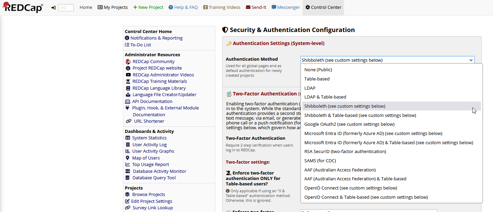
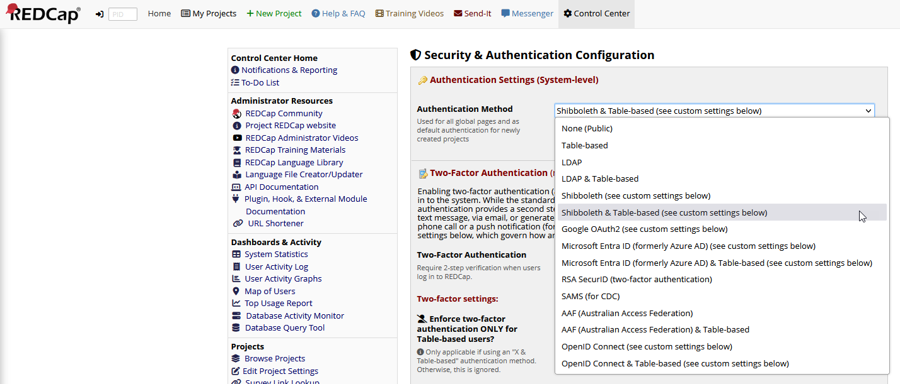
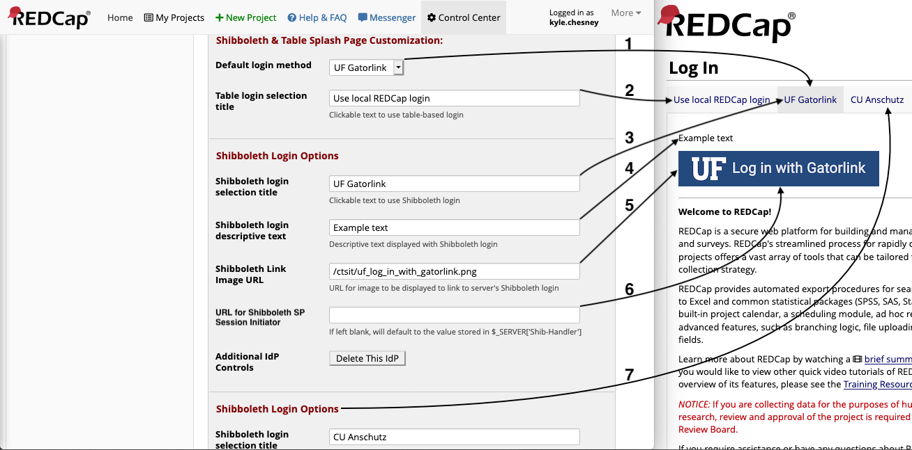

# Shibboleth Authentication for REDCap

This authentication method uses Shibboleth exclusively as REDCap's authentication method.

## Usage

Select the "Shibboleth" option in the Authentication Method dropdown menu.



Scroll further down on the page to a section titled **Additional Shibboleth Authentication Settings**, this section  will control the functionality of both Shibboleth and Shibboleth & Table options.


**Shibboleth Username Login Field**: The value that is provided by the server containing your Shibboleth login ID. If your institution does not use one of the values in the dropdown menu, select `other` and a text box will appear allowing you to enter the correct value. Make sure this string matches the value that has the username on your system. If your custom value is not found by the web server at login time, the web server will use whatever value Shibboleth has been configured to use as the username field. 

**URL for Shibboleth Logout Page**: This should be set to `/Shibboleth.sso/Logout`. This will redirect users to the server's Shibboleth logout page. You can add [parameters to alter its behavior](https://wiki.shibboleth.net/confluence/display/SHIB2/NativeSPLogoutInitiator). In this example, `return=/stage_c/` redirects users to the path `/stage_c/` on the host after shibboleth logout. The `return` parameter can be useful if your REDCap is not installed at the host's web root.

## User Information

REDCap can optionally utilize information about a user that is provided by Shibboleth when a user authenticates. Specifically, the user's first name, last name, and email address can be used to define or update those values in REDCap's database when a user logs in.

Shibboleth must be configured to expose the first name, last name, and email values. This is a two-step process.

1. The IdP must be configured to send the data to your SP
2. Your SP must map the data from the IdP as Attributes. This is typically done in a file called `attribute-map.xml`. Here are two examples:

```xml
<Attribute name="urn:oasis:names:tc:SAML:1.1:nameid-format:unspecified" id="uid" />
<Attribute name="http://schemas.xmlsoap.org/ws/2005/05/identity/claims/upn" id="eppn">
    <AttributeDecoder xsi:type="ScopedAttributeDecoder" caseSensitive="false" />
</Attribute>
<Attribute name="http://schemas.xmlsoap.org/ws/2005/05/identity/claims/givenname" id="givenName" />
<Attribute name="http://schemas.xmlsoap.org/ws/2005/05/identity/claims/surname" id="sn" />
<Attribute name="http://schemas.xmlsoap.org/ws/2005/05/identity/claims/emailaddress" id="mail" />
```
```xml
<Attribute name="username" id="uid" />
<Attribute name="urn:oid:2.5.4.4" id="sn" />
<Attribute name="urn:oid:2.5.4.42" id="givenName" />
<Attribute name="urn:oid:0.9.2342.19200300.100.1.3" id="mail" />
```

### User Information Settings


- **Set user information using data from Shibboleth**: Enable or disable the automatic population of user information using Shibboleth-provided data.
  - Set this option to "Enabled" if you want REDCap to use Shibboleth to automatically populate user information.
  - If disabled, users will need to enter their information manually.

- **Set user information on each login**: Determine whether existing user information should be overridden with Shibboleth data each time a user logs in.
  - Choose "Yes" if you want to update user information with the latest data from Shibboleth on every login.
  - Select "No" to retain user information as initially set, without updates on subsequent logins.

- **Shibboleth User First Name Field**: Specify the server variable that contains the user's first (given) name as defined by Shibboleth.
  - **Default Value**: `givenName`

- **Shibboleth User Last Name Field**: Specify the server variable that contains the user's last (family) name as defined by Shibboleth.
  - **Default Value**: `sn`

- **Shibboleth User Email Field**: Specify the server variable that contains the user's email address as defined by Shibboleth.
  - **Default Value**: `mail`

# Shibboleth & Table Authentication for REDCap

This authentication method uses both Shibboleth and Table-Based authentication for REDCap. All of the above settings are also applicable to the Shibboleth & Table authentication method.

## Usage

Select the "Shibboleth & Table-based" option in the Authentication Method dropdown menu.



The sections called "Shibboleth & Table Splash Page Customization" and "Shibboleth Login Options" contain settings that control the login page presented while using Shibboleth & Table-based option.



1. **Default login method**: Controls which login option users are first presented with upon navigating to your REDCap website. `Table-Based` or one of the IdP logins (referred to by title).
2. **Table login selection title**: Controls the text displayed in the tab used to display the table-based login.
3. **Shibboleth login selection title**: Controls the text displayed in the tab used to display a Shibboleth login.
4. **Shibboleth login descriptive text**: Controls optional text to be displayed above a Shibboleth login button.
5. **Shibboleth Link Image URL**: Controls the image presented to users in the button for a Shibboleth login.
    - Note: if using an image hosted on your REDCap server, you may path it relative to your `webroot` rather than via `https://...`.
6. **URL for Shibboleth SP Session Initiator**: Controls the URL used for Shibboleth authentication.
    - This field should only be used if you need to support multiple IdPs or require additional, advanced Shibboleth configuration. If you are unsure, leave this blank and it will be set to your server's default IdP.
7. **Additional IdP Logins**: Additional IdP options may be added, the fields are the same as 3-6. See the section below for further discussion of multiple IdPs.

## Support for Multiple IdPs

If you are hosting a REDCap instance used by multiple institutions which support Shibboleth authentication, you may wish to allow users to access REDCap via their respective institution's familiar login process; this can be accomplished by adding each institution as an additional **Id**entity **P**rovider. Additional IdPs must also be configured on your server at `/etc/shibboleth/shibboleth2.xml`. The process of adding multiple IdPs to your Shibboleth Service Provider is beyond the scope of this document.

At the end of the options for your final IdP you will see a button labeled "Add IdP", clicking this will create a new set of fields for you to enter information for an additional IdP. If you only had one IdP before clicking this button, a button labelled "Delete This IdP" will appear.  
At the end of the options for your final IdP, you will see a button labeled "Add IdP". Clicking this will create a new set of fields for you to enter information for an additional IdP. 

In a multi-IdP configuration, each IdP section will show a "Delete This IdP". Note that if you delete the final IdP login, you will be unable to add additional IdPs until you have refreshed the page. 

Adding or deleting IdP logins will not be permanent until you scroll to the bottom and click "Save Changes", after which tabs for each IdP that is filled in will appear on the login page in the order they were entered on the "Security & Authentication" page.

## Configure Shibboleth

The Shibboleth & Table Authentication login method needs to allow Shibboleth login but must not _require_ it. To meet that need, sample Apache directives for configuring your REDCap instance are available below. You will need to customize those directives for your site.

```
# Allow but do not *require* Shibboleth for a REDCap instance
# This configuration is compatible with UF's shib-table authentication method

# Instance name is "stage_c". Change this string to suit your need. 
# If your REDCap is installed at the root of your host, remove '^/stage_c' from the locations below

<Location ~ "^/stage_c">
 AuthType shibboleth
 ShibRequireSession Off
 require shibboleth
 ShibUseHeaders Off
 <RequireAny>
   require valid-user
   require ip 127.0.0.1
 </RequireAny>
</Location>

# Allow access to External Modules
<LocationMatch "^/stage_c/redcap_v[\.\d]*/ExternalModules/">
  <If "%{QUERY_STRING} =~ /.*prefix=(redcap_webservices|redcap_apb)*/" >
    AuthType shibboleth
    ShibRequireSession Off
    ShibUseHeaders Off
    require shibboleth
  </If>
</LocationMatch>
```
